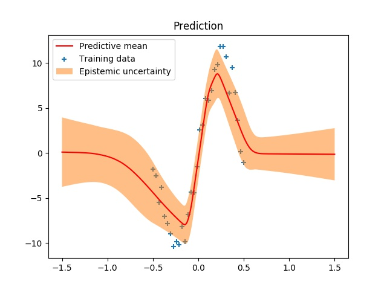

# Bayesian Linear Regression
refer to 'Weight Uncertainty in Neural Networks'(Bayes by backprop)

## 基本
使用 `class DenseVariational` 定义了一个Tensorflow
类，代表 Varitional Dense 层. 一般的全连接层包括一个
`w`矩阵和一个偏置向量`b`. 在贝叶斯神经网络中，参数数目
变为原来的2倍. 分别定义`w`和`b`的均值和标准差，其中
标准差使用softplus函数.

损失函数包括2部分：
- 最终输出结果的与标签的平方误差损失
- `w`和`b`的后验分布和先验分布之间的KL距离

注意：在程序中，类`NNVariational`有一个参数`prior_trainable`
来代表先验是否可训练. 由于我们对先验没有合理的估计，因此
这里讲该参数设置为True. 先验的参数在所有层之间共享.

## 测试
贝叶斯神经网络中每个参数都是一个分部，因此用同样的输入，运行贝叶斯
神经网络进行inference，每次的输出结果都是不同的。计算不同输出结果
的方差就代表了数据的不确定性。

如图所示，阴影部分代表多次Inference的方差. 可以看到，数据点
较少的地方方差较大。

